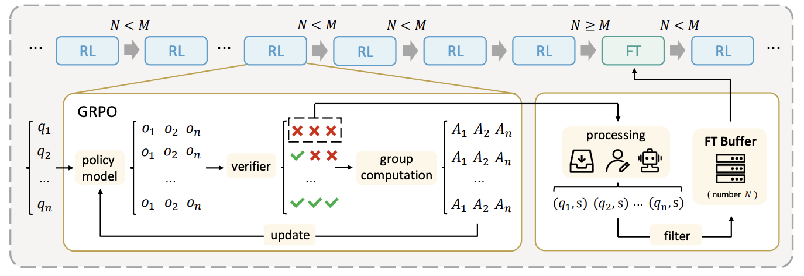

<h1 align="center"> Learning What Reinforcement Learning Can't</h1>

<h5 align="center"> If you like our project, please give us a star ⭐ on GitHub for the latest update.</h5>

# Links

- 📜 [Paper (arXiv)](https://arxiv.org/pdf/2506.07527)  
- 🤗 [HuggingFace Collection](https://huggingface.co/collections/RoadQAQ/relift-684535e199a909cad16d8b05)

---

# Getting Started

## Installation

You can install ReLIFT dependencies by running the following commands:
```bash
conda create -n relift python=3.10
conda activate relift
cd relift
pip install -r requirements.txt
pip install -e .
cd verl
pip install -e .
```

If you encounter issues when installing flash-attn, we recommend you to install it here 
[flash-attn](https://github.com/Dao-AILab/flash-attention/releases/tag/v2.7.3). For example, we use this version. 
```bash
wget https://github.com/Dao-AILab/flash-attention/releases/download/v2.7.3/flash_attn-2.7.3+cu12torch2.4cxx11abiFALSE-cp310-cp310-linux_x86_64.whl
pip install flash_attn-2.7.3+cu12torch2.4cxx11abiFALSE-cp310-cp310-linux_x86_64.whl
```

## Repo Structure

This repository includes:

- `ReLIFT`: Codes for training ReLIFT, interleaved with fine-tuning for hardest questions. Our main code changes are in ReLIFT/verl/verl/relift.
- `dataset`: Dataset for training and evaluating ReLIFT. 
- `examples`: Example script to train ReLIFT.
- `eval_scripts`: Evaluation scripts.

---

# Introduction

ReLIFT, a training method that interleaves RL with online FT, achieving superior performance and efficiency compared to using RL or SFT alone.



### Key Highlights:
- **RL Interleaved with Fine-Tuning:** Combines RL with online fine-tuning, enabling the model to learn aspects that RL alone cannot capture.
- **Efficient Online Fine-Tuning:** Requires only 13% of demonstration data, focusing exclusively on areas where RL falls short.
- **Superior Performance:** Achieves better performance and efficiency compared to using RL or SFT alone.

---

# Usage

## Data Preparation
You need to first run the data preparation script to get the training data in parquet format.
```bash
cd dataset
python prepare_train.py
```

## Model Preparation
You need to first download RoadQAQ/Qwen2.5-Math-1.5B-16k-think, RoadQAQ/Qwen2.5-Math-7B-think, RoadQAQ/Qwen2.5-7B-think. If you find downloading too difficult, you can modify the configuration files instead. For Qwen2.5-Math-1.5B-16k-think and Qwen2.5-Math-7B-think, update both config.json and tokenizer_config.json. For Qwen2.5-7B-think, only tokenizer_config.json needs to be changed.


## Training
We provide three example script to train. You can run the following command to train ReLIFT for different base models:

```bash
  sh ./examples/7b/train.sh
  sh ./examples/math-1.5b/train.sh
  sh ./examples/math-7b/train.sh
```

If you want to train on multi nodes, you can run the following command:

```bash
  source ./examples/ray_start.sh #on master node
  source ./examples/ray_connect.sh #on client nodes
  sh ./examples/math-7b/train_two_nodes.sh #on master node
```

## Evaluation
We provide scripts to evalute. You can evaluate using the following command:

```bash
  sh ./eval_scripts/inference.sh
```


## Inference

Here’s an example of using ReLIFT for inference:

<details>
<summary>Click to view inference example</summary>

```python
from transformers import AutoTokenizer
from vllm import LLM, SamplingParams

model_path="RoadQAQ/ReLIFT-Qwen2.5-Math-7B-Zero"

question = "which number is larger? 9.11 or 9.9?"

tokenizer = AutoTokenizer.from_pretrained(model_path)
messages = [{"role": "user", "content": question}]
chat = tokenizer.apply_chat_template(messages, tokenize=False, add_generation_prompt=True)

llm = LLM(model=model_path)
params = SamplingParams(temperature=0.6, max_tokens=8192)
outputs = llm.generate([chat], params)
print(outputs[0].outputs[0].text)
```

</details>


## Models

| **Model** | **Base Models** |
|-----------|----------------|
| RoadQAQ/ReLIFT-Qwen2.5-Math-7B-Zero  [Link](https://huggingface.co/RoadQAQ/ReLIFT-Qwen2.5-Math-7B-Zero) | Qwen2.5-Math-7B  [Link](https://huggingface.co/RoadQAQ/Qwen2.5-Math-7B-16k-think) |
| RoadQAQ/ReLIFT-Qwen2.5-Math-1.5B-Zero  [Link](https://huggingface.co/RoadQAQ/ReLIFT-Qwen2.5-Math-1.5B-Zero) | Qwen2.5-Math-1.5B  [Link](https://huggingface.co/RoadQAQ/Qwen2.5-Math-1.5B-16k-think) |
| RoadQAQ/ReLIFT-Qwen2.5-7B-Zero  [Link](https://huggingface.co/RoadQAQ/ReLIFT-Qwen2.5-7B-Zero) | Qwen2.5-7B  [Link](https://huggingface.co/RoadQAQ/Qwen2.5-7B-think) |

## Todo List
- [ ] Extending to 32B model.
- [ ] Supporting api to generate detailed demonstrations.
- [ ] Finding a more stable way to interleave RL with FT.
- [ ] More results on multi-task and cross-task learning.
- [ ] Proof.

---

# Acknowledgement

ReLIFT builds upon [LUFFY](https://github.com/ElliottYan/LUFFY), [veRL](https://github.com/volcengine/verl), [deepscaler](https://github.com/agentica-project/rllm), and utilizes [vLLM](https://github.com/vllm-project/vllm) for inference. We utilize [Math-Verify](https://github.com/huggingface/Math-Verify) for math reasoning evaluation. We thank the open-source community for codes, datasets and backbones, including [LUFFY](https://github.com/ElliottYan/LUFFY), [veRL](https://github.com/volcengine/verl), [deepscaler](https://github.com/agentica-project/rllm), [NuminaMath](https://huggingface.co/datasets/AI-MO/NuminaMath-CoT), [OpenR1-Math-220k](https://huggingface.co/datasets/open-r1/OpenR1-Math-220k), [Qwen2.5-Math](https://github.com/QwenLM/Qwen2.5-Math), and [DeepSeek-R1](https://github.com/deepseek-ai/deepseek-r1) model. 


